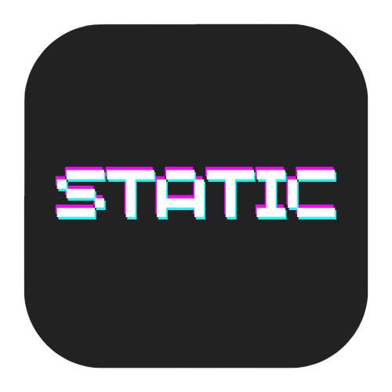

# Static



---

## Overview

**Static** is an exciting and immersive game built using cutting-edge technologies including Electron, TypeScript, C, and WebGL. Designed for seamless performance and stunning visuals, Static delivers a unique gaming experience right on your desktop.

---

## Features

- **Cross-Platform Compatibility:** Runs on Linux, Windows, and Mac via Electron.
- **High-Performance Graphics:** Leveraging WebGL for smooth 3D rendering.
- **Hybrid Architecture:** Combines C for performance-critical modules with TypeScript for UI and game logic.
- **Modern UI:** Built with Electron for a sleek, native-like desktop application.
- **Extensible:** Modular design allowing easy future updates and feature additions.
- **Persistent State:** Game data and settings persist between sessions for continuous gameplay.

---

## Getting Started

### Clone the Repository

To begin your adventure with Static, clone the repository:

```bash
git clone https://github.com/your-username/static.git